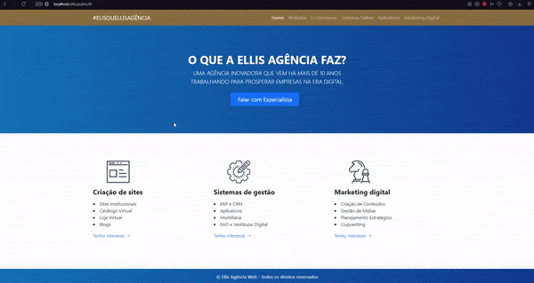
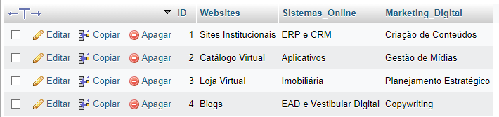

<h1 align="center">Ellis Teste</h1>

Realizado Utilizando Framework CodeIgniter

 <a href="#tecnologias">Tecnologias</a> •
 <a href="#autor">Autor</a>

---

 

### GIF & IMG

<h2>
  
</h2>

<h2>
  
</h2>

### Tecnologias

As seguintes ferramentas foram utilizadas na construção do projeto:

- [HTML](https://developer.mozilla.org/pt-BR/docs/Web/HTML)
- [CSS](https://developer.mozilla.org/pt-BR/docs/Web/CSS)
- [Bootstrap](https://getbootstrap.com)
- [PHP](https://developer.mozilla.org/pt-BR/docs/Glossary/PHP)
- [CodeIgniter](https://codeigniter.com)
---

### Autor

Feito com 💜 por Peagah 👋
